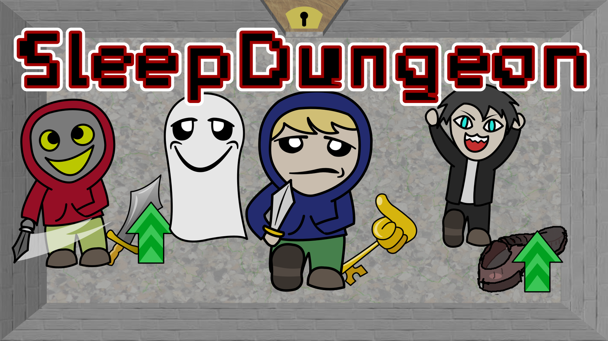
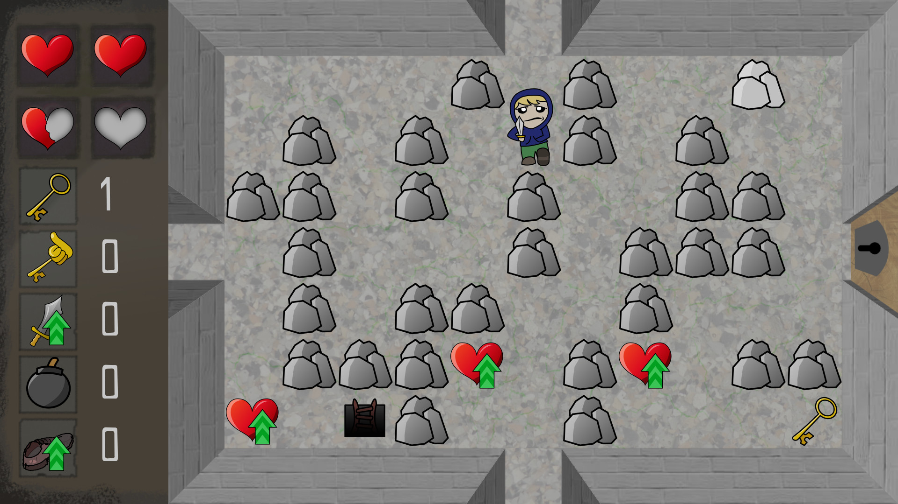
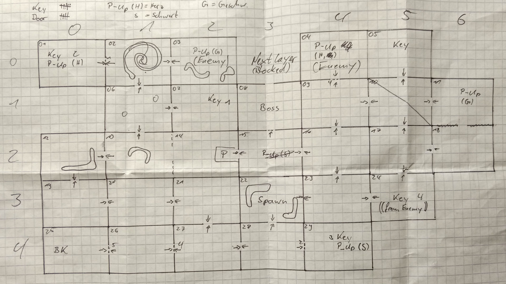

# SleepDungeon

SleepDungeon is a simple dungeon crawler and the result of a 48 hours game jam.

The game is written in Python3 and PyGame. It features simple but nice 2D
graphics and challenges you with 30 rooms over two levels.



The origin of the project was the [2. GameJam der Falkultät Informatik](https://imld.de/gamejam/)
at the TU Dresden.

During the 48 hours of the GameJam the following five members of our team,
each with individual skills and experiences developed the game:

 - [Robert Ufer](https://github.com/robuf) - Coding
 - [Martin Oehme](https://github.com/MartinOehme) - Level design and coding
 - [Karsten Lehmann](https://kalehmann.de) - Coding
 - [Robert Ludwig](https://github.com/MinniFlo) - Graphic design
 - [Lars Westermann](https://github.com/pixix4) - Coding  

A short post with a let's play of the games tutorial is also available on
[Karstens blog (German)](https://blog.kalehmann.de/blog/2018/11/11/sleepdungeon.html).

## How to play the game:

### Installing and running

Make sure you have Python3 and PyGame installed, then run

```bash
python3 bin/sleepdungeon
```

If you are too lazy for this and use windows, you can also download
[a binary for windows](https://sleepdungeon.de/downloads/sleepdungeon.zip).

There is also an
[app for macOS available](https://sleepdungeon.de/downloads/SleepDungeon.dmg).

### Controls

Use **W**, **A**, **S**, **D** or the **Arrow-Keys** to move the player. Change between
bow and sword with **E**. Attack the enemies with
the **Spacebar**. If you have a bomb in your inventory - plant it with **Q**.

### Main menu

You can play the game in 3 different difficulties:

**Easy**, you will find many hearts and they will heal 2 health points.

**Original mode**, just as intended by the team and **hard mode** - you will
find only a few hearts.

### Gameplay

Collect all five keys and the motivating boss key to reach the final room.

Heal your player with hearts and collect upgrades to become stronger and faster.

The game also supports joysticks.

The first level is a little tutorial to get used to the game play.


## Repository

The **master** branch of this repository contains an updated version of the game with additional features.

Meanwhile the **original** branch contains the version that was created at the GameJam with some additions, such as this Readme file or the license.

## Levels

The level design is documented in [this file](sleepdungeon/res/lvl/01/rooms). There also exists an early sketch of the level design:


## Why is this game called SleepDungeon

The name of the game is derived from the name of our team, **"Team sleep"** and the genre of the game.

## Credits

Aside from all members of the team and their work, the following external resources were used:

### Music

[levelsoundtrack](/sleepdungeon/res/sound/levelsoundtrack.ogg) is a slightly modified version of
[La Calahorra](http://freemusicarchive.org/music/Rolemusic/~/calahorra) by
[Rolemusic](https://freemusicarchive.org/music/Rolemusic/) used under
[CC BY](https://creativecommons.org/licenses/by/4.0/)
/ Made the sound loopable

[bosslevelsoundtrack](/sleepdungeon/res/sound/bosslevelsoundtrack.ogg) is a modified
version of a soundtrack by [Lukas Palásti](https://soundcloud.com/naughtyloss).
